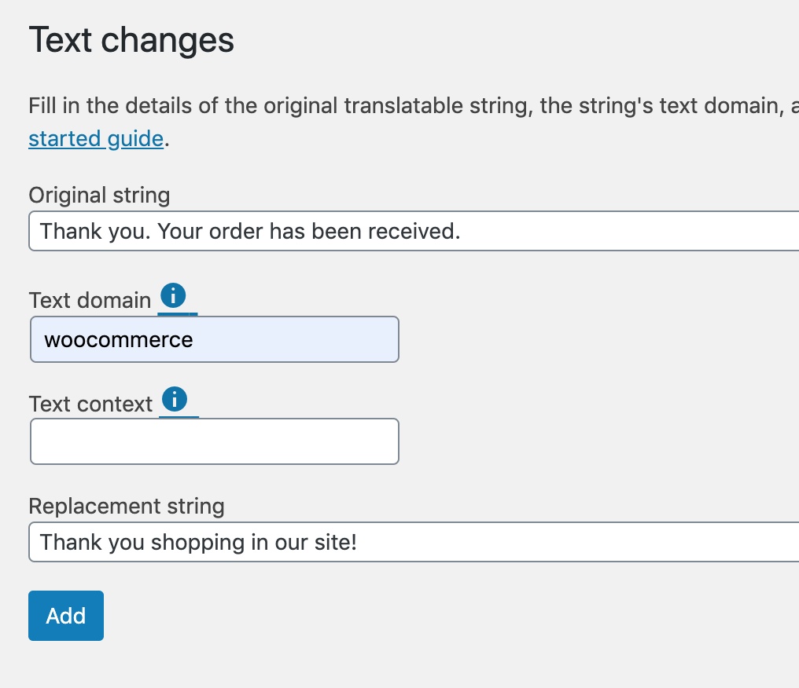
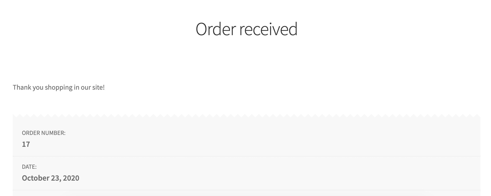

Here is how you can change your online's store **Order Received Thank You Message** after your customers completed their order.

Add the below code snippet in your child theme's **functions.php**

<!--more-->

```php
add_filter( 'woocommerce_thankyou_order_received_text', 'custom_thank_you' );

function custom_thank_you() {
  $added_text = __('Thank you shopping in our site!', 'woocommerce');
  return $added_text ;
}
```

### I cannot add this code.

If you do not have coding skills, no worries. You can install a plugin called [Say What?](https://wordpress.org/plugins/say-what/) and change the text from there.

After you installed the plugin, go to your dashboard menu **Tools &raquo; Text Changes**

Add the text as seen on the screenshot below then save.




When done, you can test it.



